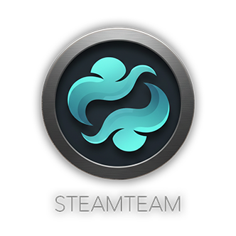

Find your dream team (on Steam).

---

## 🎮 What is Steamteam?

Steamteam helps players discover other users with similar gaming preferences.

Instead of relying on friend lists or manual searching, Steamteam analyzes:
- played games
- genres
- playtime distribution

and match users using vector-based similarity.

The goal is to make it easier to find like-minded gamers in a data-driven and testable way.

---

## 🧠 How it works (overview)

1. Steam game data is fetched via the Steam Web API
2. The data is transformed into weighted vectors
3. A snapshot of the user profile is created
4. Users are matched by comparing snapshots

Matching never operates directly on raw Steam data — only on snapshots.

---

## 📸 Snapshots

A snapshot is a compact representation of a user’s gaming profile at a specific moment in time.

Each snapshot contains:
- user ID
- timestamp
- weighted game vector
- weighted genre vector
- weighted category vector
- 3 most played games

Snapshots can be stored, printed, exported as JSON, and compared efficiently.
This keeps matching fast, stable, and reproducible.

---

## 🧮 Matching logic

Users are matched using cosine similarity on vectors.

Three signals are combined:
- Genre similarity (primary)
- Game similarity (secondary)
- Category / playstyle similarity

Each comparison produces a score between 0.0 and 1.0.

---

## 🗄️ Database

Steamteam uses SQLite for simplicity and portability.

The database contains three tables:
- users
- snapshots
- games_cache

Snapshots are stored as JSON blobs to keep the vector format flexible and version-safe.

---

## 🧪 Testing without real users (important)

To test the system without registering real users or using the Steam API, the project includes the script:

scripts/seed_fake_accounts.py

What it does:
- creates a local SQLite database
- creates all core tables
- inserts fake users with predefined snapshots

This allows immediate testing of matching logic, similarity scores, and UI behavior.
No Steam account or API key is required.
Just login as one of the fake accounts. BUT: Profile sync will not work without API key.

How to run:
From the project root (with venv activated):
python scripts/seed_fake_accounts.py

---

## 🖥️ Features

- Steam Web API integration
- Snapshot-based user matching
- Vector similarity algorithms
- SQLite database persistence
- Graphical user interface (Tkinter)

---

## ⚙️ Requirements

- Python 3
- Internet connection (only required for Steam API usage)
- Steam account (optional)
- Steam Web API key (optional)

---

## 🚀 Running the application
Clone repository and create virtual environment:  
```
git clone https://github.com/nicklasthegerstrom-byte/steamteam.git
cd steamteam
python -m venv venv
```
Activate venv:

Windows:  
`venv\Scripts\activate`

MacOS / Linux:  
`source venv/bin/activate`

Install dependencies:  
`pip install -r requirements.txt`

(Optional) Add Steam API key in .env:  
`STEAM_API_KEY=your_api_key_here`

Run the app:  
`python app.pyw`

---

## 👥 Contributors & Responsibilities

Constantine - [AeolianOpus](https://github.com/AeolianOpus):
- Project structure
- Settings
- Models (core classes)
- Logger

Even - [evenhadeghe](https://github.com/evenhadeghe):
- Graphical user interface

Nick - [nicklasthegerstrom-byte](https://github.com/nicklasthegerstrom-byte):
- Vector logic
- Database setup and functions
- Matchcard / Selfcard (Snapshot vizualisation)

Erik - [ErikCoderMan](https://github.com/ErikCoderMan):
- Steam API functions
- seed_fake_accounts script
- Master testing

Adam - [adamwelday](https://github.com/adamwelday):
- Matching logic and similarity algorithms

---

## 🛠️ Development workflow (contributors)

- Development is done on feature branches from dev/main
- No direct commits to dev
- All changes are merged via Pull Requests
- Branch names should be clear and descriptive
