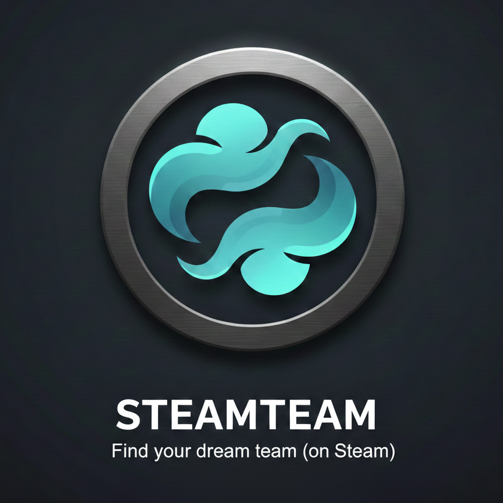

# Steamteam
Match with other users based on gaming interests.

## About
This project allows users to import their Steam game data and discover other users with similar gaming interests.
By analyzing played games, genres, and game IDs, the application matches users based on shared preferences.
The goal is to help players find like-minded gamers and potential gaming partners through data-driven matching.

## Features
-  User accounts creation system  
-  Game related data via Steam API support  
-  Graphical user interface  
-  User matching algoritm  with data vector technology  
-  SQLite3 for database management  

## Requirements
-  Internet connection
-  Steam account  
-  Steam Web API-key
-  Python3

## Installation
Open a terminal / command prompt and run the following commands.  
During installation replace `python` with `python3` or `py` depending on your system.  
#### 1. Clone the repository and navigate to project folder  
   ```
   git clone https://github.com/nicklasthegerstrom-byte/steamteam.git
   ```
   ```
   cd steamteam
   ```

#### 2. Create and activate a virtual environment  

   - Windows:   
   ```
   python -m venv venv
   ```
   ```  
   venv\Scripts\activate  
   ```
   - MacOS / Linux:  
   ```
   python -m venv venv  
   ```
   ```
   source venv/bin/activate  
   ```

#### 3. Install dependencies  
- Option (1): This will install all dependencies from `pyproject.toml`:   
  - Install `poetry` if you do not have it:  
  https://python-poetry.org/docs/#installation  
  - Install all dependencies::
  ```
  poetry install
  ``` 
  - Activate the Poetry virtual environment:  
  ```
  poetry shell
  ```
- Option (2): This will install all dependencies from `requirements.txt`  
  - Run:
  ```
  pip install -r requirements.txt
  ```
## Running
Run `app.pyw` from the project root folder:    
```
python app.pyw
```

## Contributors  
   Constantine - [AeolianOpus](https://github.com/AeolianOpus)  

   Even - [evenhadeghe](https://github.com/evenhadeghe)  

   Nicklas - [nicklasthegerstrom-byte](https://github.com/nicklasthegerstrom-byte)  

   Erik - [ErikCoderMan](https://github.com/ErikCoderMan)  

   Adam - (profile missing)

## Development Workflow

The project structure is set up in the dev branch.
All development work should follow the workflow below.

#### 1. Setup and Branching  
Open your CLI and navigate to the project directory:  
```
   cd "path/to/your/project-folder"
   cd steamteam
   git checkout dev  
   git pull
```
Create a new branch to work in:
```
   git checkout -b feat/matching
```
Branch naming is important.
This is only an example. Use clear and descriptive names such as:
`feat/matching`, `docs/readme`, `db/database`, `test/tests`

The goal is that everyone (and the tech lead) can easily understand what you are working on.  
Pull requests with unclear or misleading branch names may be rejected.  

#### 2. First Push (Important)

The first time you push a new branch, you must run:
```
   git push -u origin <branch-name>
```
This is required unless you have configured a global push.autoSetupRemote.

#### 3. Creating Files Correctly

When creating new files, make sure they are placed in the correct directory from the start.  
Example if settings.py should be located in the data folder:

PowerShell:  
```
   New-Item .\data\settings.py -Force
```
Bash / other shells:  
```
   touch data/settings.py
```

Always verify that files are created in the correct location before starting work.

#### 4. Development and Commits

- Work only inside your own branch.
- Commit your changes properly
- Remember to:
  - Save your files (CTRL + S in VS Code)  
  - Commit your changes properly  

Example:
```  
   git add .
   git commit -m "Clear and descriptive commit message"
   git push
```

#### 5. Pull Request to dev

When your work is complete and ready to be merged:  
- Go to the steamteam repository on GitHub  
- Open the Pull Requests tab  
- Click Create Pull Request  
- Set:
  - Base branch (left): dev
  - Compare branch (right): your feature branch  

Submit the pull request.

#### 6. Review  
The tech lead will review the pull request on GitHub and approve or request changes before merging into dev.

## Documentation  
### Modules:  
#### api/steam_id.py:  
This module is responsible for fetching and processing Steam user game data. It supports both real Steam API calls and mock data generation for testing purposes.

The module exposes two public functions:  
- get_user_top_games  
- get_fake_user_top_games  

It uses the Steam Web API to retrieve owned games, enrich them with genre and category data, and return a structured result that can be used for user matching.

##### Environment Configuration  

To use real Steam API functionality, a Steam API key is required.

The key must be stored in a .env file located in the project root directory.
It is loaded automatically when data/settings.py is imported into the application.

Required environment variable:

- STEAM_API_KEY=your_steam_api_key_here

If the Steam API key is missing or invalid, only mock data functions will work.

##### Important  
`.env` is added to .gitignore because it is were the steam_api_key is expected, it is personal and should not be shared.

##### How to Get a Steam API Key  
1. Log in to your Steam account  
2. Visit the Steam Web API key registration page:  
  https://steamcommunity.com/dev/apikey
3. Register a new API key (a domain name is required, but any placeholder works for development)
Copy the generated key and add it to your .env file (it is gitignored)

##### Public Functions:
##### `get_user_top_games(user_string, top_n=5)`

Fetches and returns a Steam user’s top played games, enriched with genre and category data from the Steam Store API.

Accepted user identifiers:  
- SteamID64  
- Vanity name  
- Full Steam profile URL (both /id/ and /profiles formats)  

Parameters:
- user_string (string): SteamID64, vanity name, or full Steam profile URL
- top_n (integer, optional): Number of top games to return (default is 5)

Returns:  
- steam_id: Resolved SteamID64
- game_count: Number of games returned
- games: List of enriched game objects, including:
   - appid
   - name
   - playtime_forever
   - playtime_2weeks
   - genres
   - categories

This function requires a valid STEAM_API_KEY.

##### `get_fake_user_top_games(user_string, top_n=5)`

Generates mock Steam user game data for testing and development without making real API calls.
This function does not require a Steam API key and can be used when:  

- Developing offline
- Writing tests
- Prototyping matching logic

Parameters:  
- user_string (string): Any string used to simulate a user  
- top_n (integer, optional): Number of fake games to generate (default is 5)  

Returns:
- steam_id: Randomly generated SteamID64
- game_count: Number of games generated
- games: List of mock enriched game objects
   - appid
   - name
   - playtime_forever
   - playtime_2weeks
   - genres
   - categories

##### Notes

Real Steam API calls may fail due to rate limits, network issues, or private profiles

Store metadata (genres and categories) is fetched separately and may be incomplete for some games

